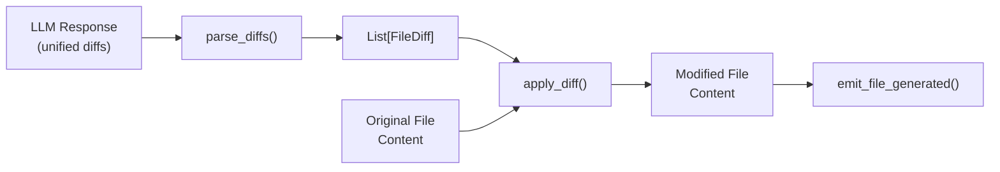

# Diff-Based Surgical Edits

## Architecture Overview



## 1. New Module: `relay_app/services/handlers/diff_utils.py`

Create a dedicated module with:

### FileDiff Dataclass (simple as requested)

```python
@dataclass
class FileDiff:
    path: str           # e.g., "src/App.tsx"
    hunks: List[str]    # List of raw unified diff hunks
```

### parse_diffs(full_llm_str: str) -> List[FileDiff]

Parse unified diffs from LLM output. Expected format from LLM:

````
```diff
--- src/App.tsx
+++ src/App.tsx
@@ -10,6 +10,7 @@ function App() {
   const [count, setCount] = useState(0);
+  const [name, setName] = useState('');
   
   return (
@@ -25,4 +26,4 @@ function App() {
-      <button>Old Text</button>
+      <button>New Text</button>
     </div>
````

- Extracts file path from `--- path` line
- Groups all hunks by file path
- Handles multiple files in one response

### apply_diff(original_content: str, diff: FileDiff) -> str

Apply unified diff hunks to original file content:

- Parse each hunk header (`@@ -start,count +start,count @@`)
- Match context lines to find correct location (fuzzy matching with 3-line context)
- Apply removals (`-` lines) and additions (`+` lines)
- Return modified content

## 2. Update System Prompt in `edit_handler.py`

Modify `EDIT_SYSTEM_PROMPT` and `EDIT_PROMPT_TEMPLATE` to instruct the LLM:

````python
## Output Format
For each file you modify, output a unified diff:

```diff
--- src/path/to/file.tsx
+++ src/path/to/file.tsx
@@ -LINE,COUNT +LINE,COUNT @@ optional context
 context line (unchanged)
-line to remove
+line to add
 context line (unchanged)
````

Rules:

- Include 3 lines of context before and after changes
- Use `-` prefix for removed lines, `+` for added lines
- Space prefix for unchanged context lines
- Multiple hunks allowed for non-adjacent changes
````

## 3. Update `_generate_edits()` in [edit_handler.py](relay_app/services/handlers/edit_handler.py)

Modify the method at ~line 323 to:

1. Parse diffs with `parse_diffs(full_content)` instead of `parse_code_blocks()`
2. Get original file contents from `file_contents` dict
3. Apply each diff with `apply_diff(original, diff)`
4. Create `FileChange` objects with the resulting content
5. Emit `emit_file_generated()` as before

Key code change:

```python
# Parse diffs instead of full files
from .diff_utils import parse_diffs, apply_diff

diffs = parse_diffs(full_content)
for diff in diffs:
    original = file_contents.get(diff.path, "")
    new_content = apply_diff(original, diff)
    file_change = FileChange(
        path=diff.path,
        action='modify',
        language=self._get_language(diff.path),
        content=new_content,
    )
    yield self.emit_file_generated(file_change)
    files.append(file_change)
````


## 4. Tests: `tests/test_diff_utils.py`

Comprehensive tests for:

**parse_diffs tests:**

- Single file, single hunk
- Single file, multiple hunks
- Multiple files
- Edge cases: empty input, malformed diffs

**apply_diff tests:**

- Simple single-line change
- Multi-line additions
- Multi-line deletions
- Multiple hunks in different locations
- Context matching (handles whitespace variations)
- Edge case: change at start/end of file

## Files to Create/Modify

| File | Action |

|------|--------|

| `relay_app/services/handlers/diff_utils.py` | Create new |

| `relay_app/services/handlers/edit_handler.py` | Modify prompts and `_generate_edits()` |

| `tests/test_diff_utils.py` | Create new |